# tweetsOLAPing : an end-to-end social-media data-warehousing project :

[](https://www.python.org/)
[](https://GitHub.com/Naereen/ama)

i'll walk you through an execution example using light-weight (very) data to show you the results.

## Table of Contents :
- [Twitter DataTypes :](#twitter-datatypes--)
  * [TweetDataType :](#tweetdatatype--)
  * [UserDataType :](#userdatatype--)
- [ENV set-up :](#0--env-set-up-)
- [ETL pipeline :](#1--etl-pipeline--)
  * [a) Extraction :](#a--extraction--)
  * [b) Transformation :](#b--transformation--)
  * [c) Loading :](#c--loading--)
    + [SSIS modeling :](#ssis-modeling--)
    + [SSAS cube modeling :](#ssas-cube-modeling--)
- [Analysis :](#2-analysis--)
  * [MDX queries :](#mdx-queries--)
  * [powerBI report :](#powerbi-report--)
 - [References :](#3-references--)

## Twitter DataTypes :

### TweetDataType :

```json
{
   "created_at":"Sat Jul 01 23:47:16 +0000 2017",
   "id":881298189072072708,
   "id_str":"881298189072072708",
   "text":"seu perfil foi visto por 5 pessoas nas \u00faltimas 4 horas https:\/\/t.co\/cKb35CahC7",
   "source":"\u003ca href=\"http:\/\/www.twitcom.com.br\" rel=\"nofollow\"\u003eTwitcom - Comunidades \u003c\/a\u003e",
   "truncated":false,
   "in_reply_to_status_id":null,
   "in_reply_to_status_id_str":null,
   "in_reply_to_user_id":null,
   "in_reply_to_user_id_str":null,
   "in_reply_to_screen_name":null,
   "user": UserDataType,
   "geo":null,
   "coordinates":null,
   "place":null,
   "contributors":null,
   "is_quote_status":false,
   "retweet_count":0,
   "favorite_count":0,
   "entities":{
      "hashtags":[

      ],
      "urls":[
         {
            "url":"https:\/\/t.co\/cKb35CahC7",
            "expanded_url":"http:\/\/twcm.me\/5bHmW",
            "display_url":"twcm.me\/5bHmW",
            "indices":[
               55,
               78
            ]
         }
      ],
      "user_mentions":[

      ],
      "symbols":[

      ]
   },
   "favorited":false,
   "retweeted":false,
   "possibly_sensitive":false,
   "filter_level":"low",
   "lang":"pt",
   "timestamp_ms":"1498952836660"
}
```

### UserDataType :

```json
{
   "id":2696402179,
   "id_str":"2696402179",
   "name":"$AVAGE",
   "screen_name":"SavageHumor",
   "location":null,
   "url":null,
   "description":"SAVAGE TWEETS \nWARNING: 18+ Content",
   "protected":false,
   "verified":false,
   "followers_count":150201,
   "friends_count":0,
   "listed_count":94,
   "favourites_count":85,
   "statuses_count":10696,
   "created_at":"Thu Jul 31 18:52:37 +0000 2014",
   "utc_offset":-18000,
   "time_zone":"Central Time (US & Canada)",
   "geo_enabled":false,
   "lang":"en",
   "contributors_enabled":false,
   "is_translator":false,
   "profile_background_color":"000000",
   "profile_background_image_url":"http:\/\/abs.twimg.com\/images\/themes\/theme1\/bg.png",
   "profile_background_image_url_https":"https:\/\/abs.twimg.com\/images\/themes\/theme1\/bg.png",
   "profile_background_tile":false,
   "profile_link_color":"DD2E44",
   "profile_sidebar_border_color":"000000",
   "profile_sidebar_fill_color":"000000",
   "profile_text_color":"000000",
   "profile_use_background_image":false,
   "profile_image_url":"http:\/\/pbs.twimg.com\/profile_images\/875059551204249601\/J_XlKaiO_normal.jpg",
   "profile_image_url_https":"https:\/\/pbs.twimg.com\/profile_images\/875059551204249601\/J_XlKaiO_normal.jpg",
   "profile_banner_url":"https:\/\/pbs.twimg.com\/profile_banners\/2696402179\/1416368695",
   "default_profile":false,
   "default_profile_image":false,
   "following":null,
   "follow_request_sent":null,
   "notifications":null
}
```

## 0- ENV set-up:

the extraction/transformation steps of the pipeline will need the following environment set-up :
```shell
pip install virtualenv
```
```shell
virtualenv tweetsOLAPingENV
```
```shell
source tweetsOLAPingENV/bin/activate
```
```shell
pip install -r requirements.txt
```

as far as the Loading ETL step and the final analysis, make sure you have the following :
1. MSSMS (microsoft Sql server managment studio).
2. SSDT (Sql server data tools).
3. SSIS (Sql server integration service).
4. SSAS (Sql server analysis service).
5. powerBI.

## 1- ETL pipeline : 
### a) Extraction :

the very first step is to prepare the <b>tweetsPOOLs.csv</b> file as in https://github.com/MohamedHmini/tweetsOLAPing/blob/master/extraction/archivedTweetsCrawler/tweetsPOOLs.csv.

then we shall execute the <b>Scrapy Spider</b> to crawl the archive needed website pages as follows : 

```shell
  cd extraction/archivedTweetsCrawler
  scrapy crawl -o tweetsSTREAMs.csv tweets
```
after that you will get a file like the one in here : https://github.com/MohamedHmini/tweetsOLAPing/blob/master/sample-data/tweetsSTREAMs.csv

the next step is to structure that CSV file into a tree like structure composed of directories and files :
```shell
  cd extraction/
  python tweetsPOOLsParser.py tweetsSTREAMs.csv ../root_urls/
```
the output will be somewhat like this (light-weight) example : https://github.com/MohamedHmini/tweetsOLAPing/tree/master/sample-data/urls_root

next we have to perform a random selection to select only some URLs and not all, note that each URL will bring you up to 5000 tweets :

```shell
  cd extraction/
  python urlsRandomSelector.py ../root_urls/ ../chosen_urls.txt 700
```

again check this link for an output example : https://github.com/MohamedHmini/tweetsOLAPing/blob/master/sample-data/chosen_urls.txt

now after that we have all the needed URLs in a single file we can start downloading :

```shell
  cd extraction/
  python tweetsDownloader.py ../chosen_urls.txt ../downloaded_pools/ ../download_error.txt
```

again check this link for an output example : https://github.com/MohamedHmini/tweetsOLAPing/tree/master/sample-data/downloaded-pools

after we downloaded the files you will notice that they are compressed with a .bz2 file extension thus you have to decompress them somehow, i won't provide a solution in this stage.

again check this link for an output example : https://github.com/MohamedHmini/tweetsOLAPing/tree/master/sample-data/decompressed-pools

note that i provide a script to lookup tweets from the twitterAPI directly using the downloaded tweets IDs, cause the tweets have been pulled in the stream by the collected you will find that most of them has zero metrics, i solve this solution using a context-aware random generator.

### b) Transformation :

as for the transformation it's composed of two parts, first we transform our data from JSON to CSV and create all the needed derived attributes, also we shall remove twitto duplicates using, beware that the cleanUsersCSV.py script will using multi-threading to speed-up the I/O operations and the result will be stored in a directory, you can then merge them on your own.

```shell
  cd transformation/
  python prepareTweets.py ../decompressed_pools/ ../tweets.csv ../twittos.csv ../trans-err.txt
  python cleanUsersCSV.py ../twittos.csv ../twittos
```

the second part consists of performing NLP analysis on the tweets to generate the sentiment-score and the content-classification, you have to provide the projectkey.json file from google NLP APIin the same directory.

```shell
  cd transformation/
  python performNLPanalysis.py ../decompressed_pools/ ../tweets_sentiments.csv ../sent-err.txt
```

again check this link for an output example : https://github.com/MohamedHmini/tweetsOLAPing/tree/master/sample-data/processed

### c) Loading :

before starting the SSIS process you have to provide a normalized data in the right path (shall be fixed) :

```shell
  cd loading/
  python dataNormalization.py ../twittos.csv ../tweets.csv ../data/normalized
```

again check this link for an output example : https://github.com/MohamedHmini/tweetsOLAPing/tree/master/sample-data/normalized-data

for SSIS logic i provide the full model : https://github.com/MohamedHmini/tweetsOLAPing/tree/master/loading/tweetsOLAPing_loading

as well as the SSAS logic is fully provided : https://github.com/MohamedHmini/tweetsOLAPing/tree/master/analysis/tweetsOLAPing_analysis

#### SSIS modeling : 

after setting up all the connections ( the normalized data as well as the OLEDB destinations), we now arrive at the integration step or the data loading : 

<p align="center">
  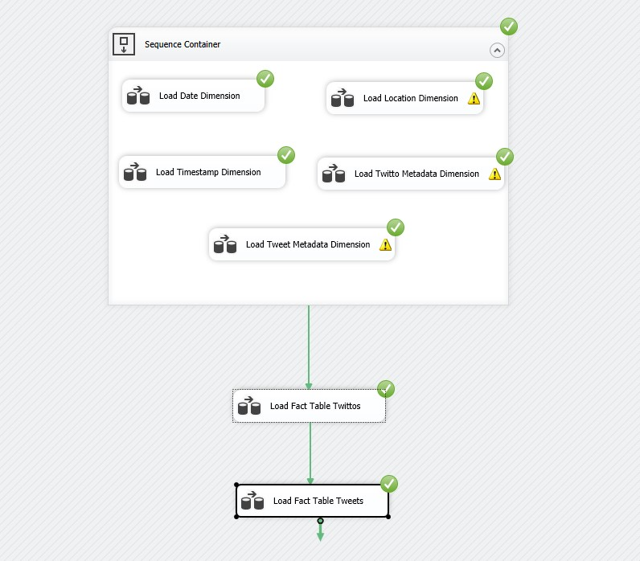
</p>
<p align="center">
  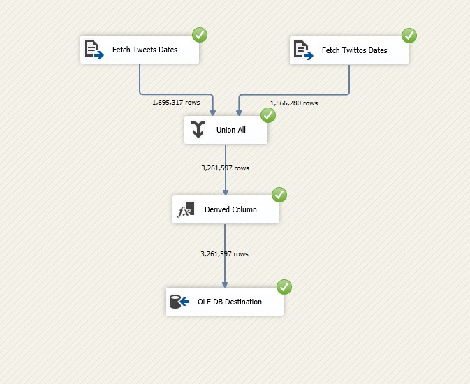
</p>
<p align="center">
  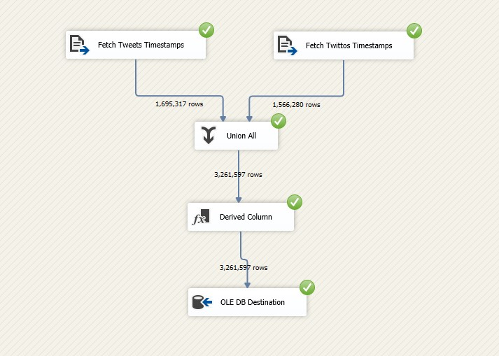
</p>
<p align="center">
  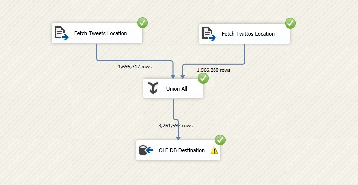
</p>
<p align="center">
  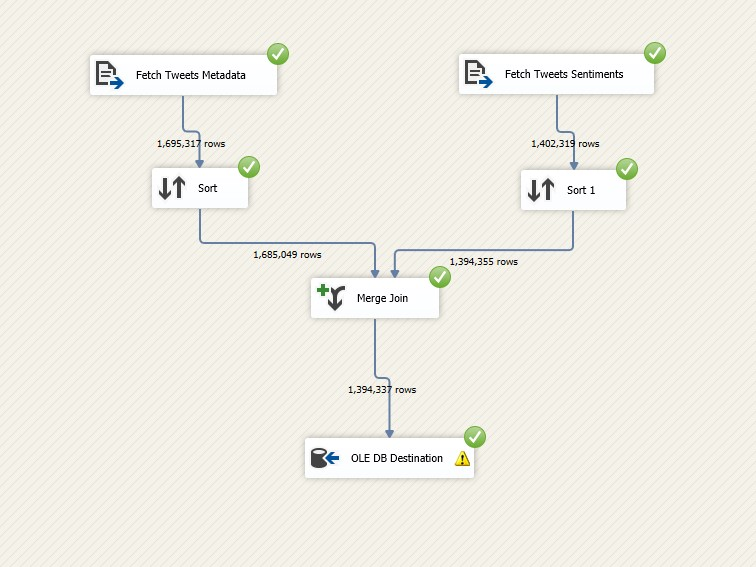
</p>
<p align="center">
  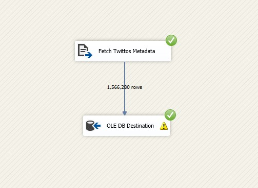
</p>
<p align="center">
  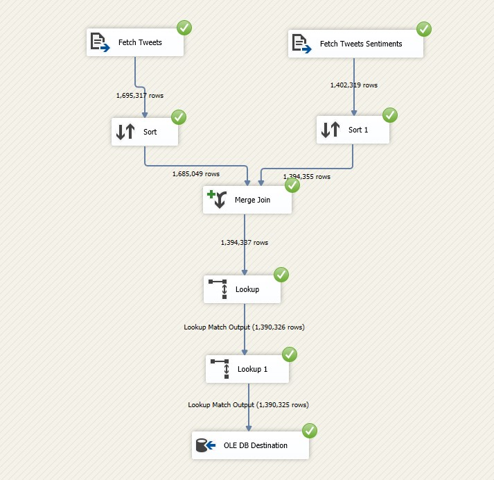
</p>
<p align="center">
  
</p>

#### SSAS cube modeling : 

<p align="center">
  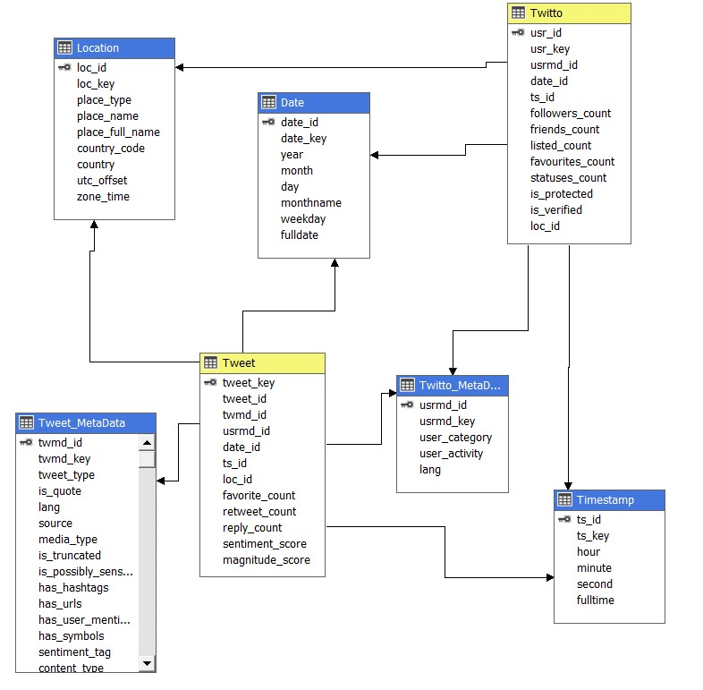
</p>

## 2. Analysis :

### MDX queries : 

```sql
SELECT 
  NON EMPTY
  (
    [Twitto Meta Data].[User Category].children, 
    [Measures].[Retweet Count]
  ) ON COLUMNS,
  NON EMPTY 
  (
    [Twitto Meta Data].[User Activity].children
  ) ON ROWS
FROM
  [TweetsOLAPing_cube]
```

```sql
SELECT 
  NON EMPTY
  (
    [Twitto Meta Data].[User Category].children, 
    [Measures].[Retweet Count]
  ) ON COLUMNS,
  NON EMPTY 
  (
    [Twitto Meta Data].[User Activity].children, 
    [Tweet Meta Data].[Sentiment Tag].children
  ) ON ROWS
FROM
  [TweetsOLAPing_cube]
```

```sql
SELECT 
  NON EMPTY
  (
    [Tweet Meta Data].[Media Type].children, 
    [Measures].[Retweet Count]
  ) ON COLUMNS,
  NON EMPTY 
  (
    [Tweet Meta Data].[Has Hashtags].children, 
    [Date].[Weekday].children
  ) ON ROWS
FROM
  [TweetsOLAPing_cube]
```

### powerBI report :

the final report is provided in : https://github.com/MohamedHmini/tweetsOLAPing/tree/master/analysis/powerBI

here are some examples :

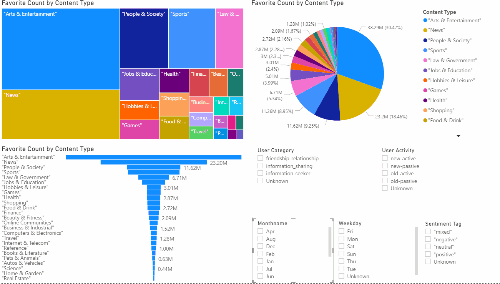
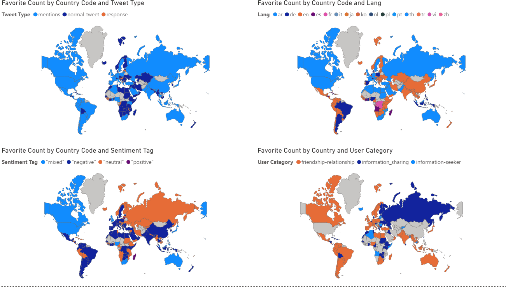
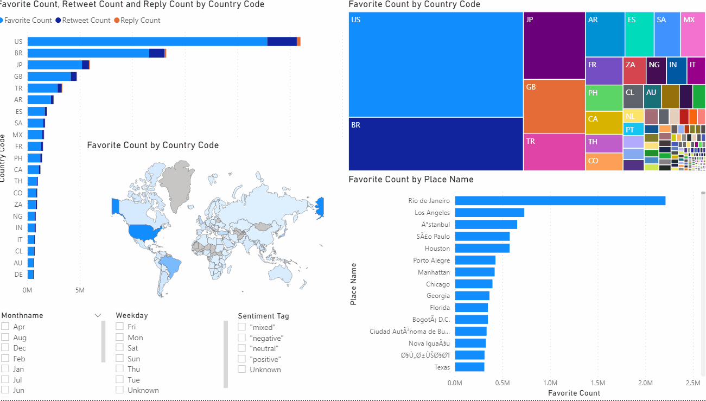
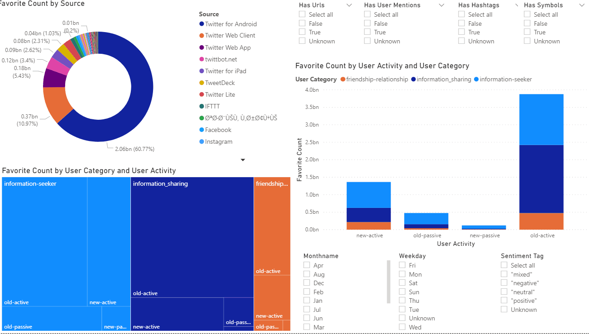
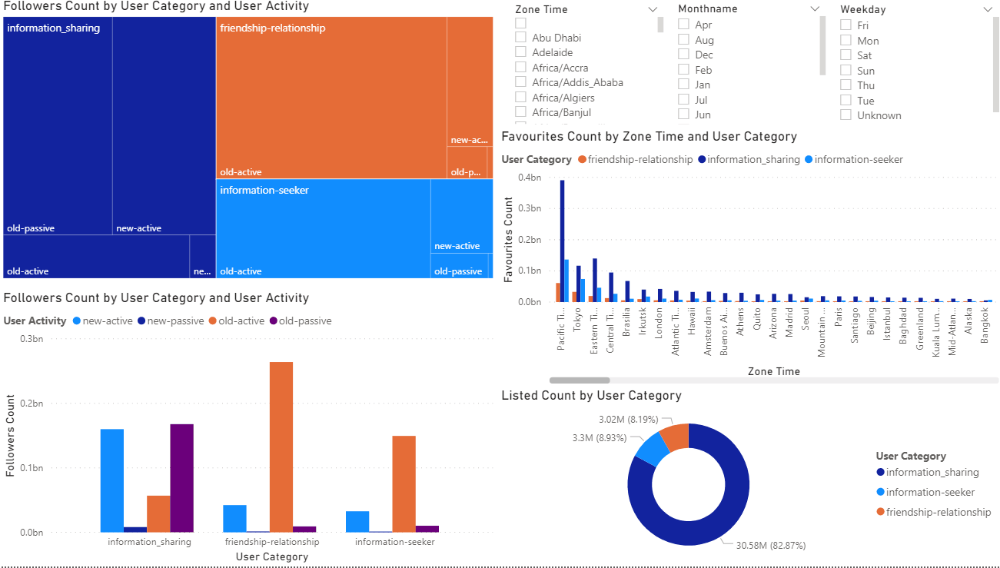


## references : 

[1] Maha Ben Kraiem, Jamel Feki, Ka¨ıs Khrouf, Franck Ravat, Olivier Teste. OLAP of the tweets: From modeling to exploitation. IEEE International Conference on Research Challenges in Information Science, Marrakesh, Morocco, May 2014.

[2] Maha Ben Kraiem, Jamel Feki, Ka¨ıs Khrouf, Franck Ravat, Olivier Teste. OLAP4Tweets: Multidimensional Modeling of tweets. 19th East-European Conference on Advances in Databases and Information Systems, Poitiers, France, September 2015.

[3] Nafees Ur Rehman, Svetlana Mansmann, Andreas Weiler, Marc H. Scholl. Building a DataWarehouse for Twitter Stream Exploration. IEEE/ACM International Conference on Advances in Social Networks Analysis and Mining, Istanbul, turkey, August 2012.


<b> MOHAMED-HMINI 2020</b>
